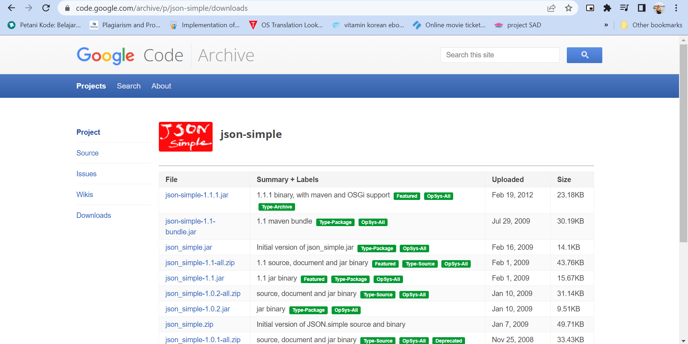

## Getting Started

Welcome to the VS Code Java world. Here is a guideline to help you get started to write Java code in Visual Studio Code.

## Folder Structure

The workspace contains two folders by default, where:

- `src`: the folder to maintain sources
- `lib`: the folder to maintain dependencies

Meanwhile, the compiled output files will be generated in the `bin` folder by default.

> If you want to customize the folder structure, open `.vscode/settings.json` and update the related settings there.

## Dependency Management

The `JAVA PROJECTS` view allows you to manage your dependencies. More details can be found [here](https://github.com/microsoft/vscode-java-dependency#manage-dependencies).

How to run:

Download the file, in folder Interview Versa_Fardia Nadhirah open src folder and click on bigBang.java

Make sure add json-simple library in project before run 
https://code.google.com/archive/p/json-simple/downloads>Downloads>json-simple-1.1.1.jar (The first file)

using visual studio:
Explorer>Java projects>Referenced libraries>add file>choose downloaded jar.

Finally,run

